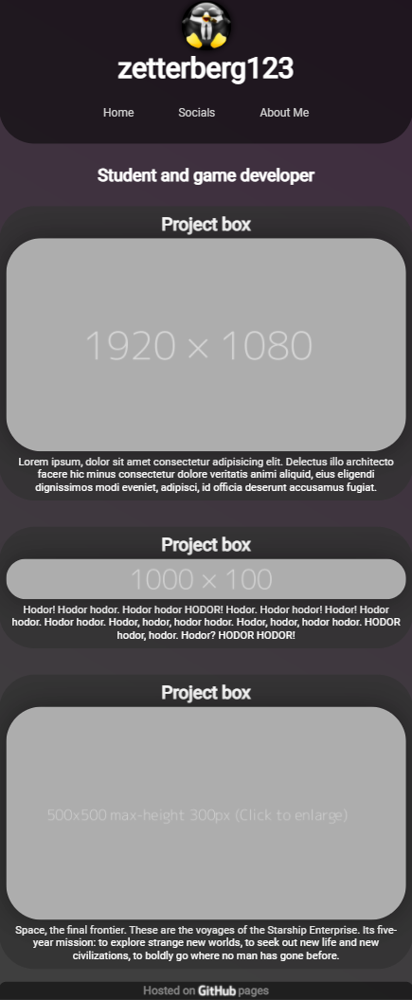

# Website

Personal website built with astro

## Install

Clone this repo and run from a terminal

```bash
npm install
```

Then, to run locally with live reload:

```bash
npm run dev
```

### Commands

All commands are run from the root of the project, from a terminal:

| Command                   | Action                                           |
| :------------------------ | :----------------------------------------------- |
| `npm install`             | Installs dependencies                            |
| `npm run dev`             | Starts local dev server at `localhost:4321`      |
| `npm run build`           | Build your production site to `./dist/`          |
| `npm run preview`         | Preview your build locally, before deploying     |
| `npm run astro ...`       | Run CLI commands like `astro add`, `astro check` |
| `npm run astro -- --help` | Get help using the Astro CLI                     |

## Progress images

- First iteration
  
- Second iteration
  
- Final iteration

  Desktop layout

  
  Mobile layout

  
