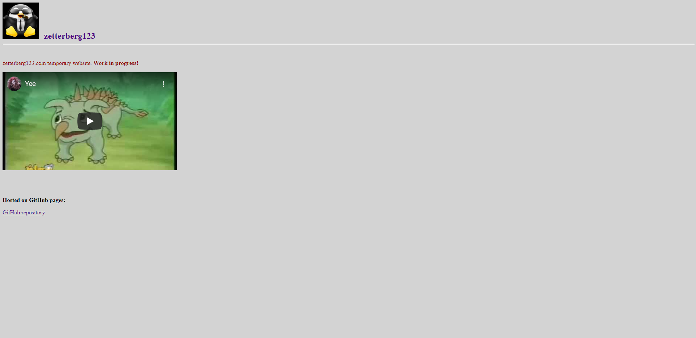
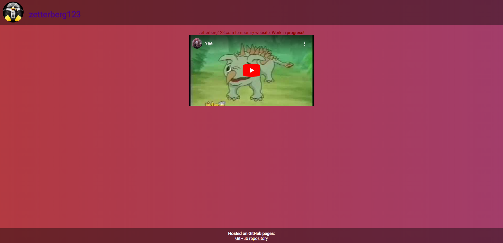
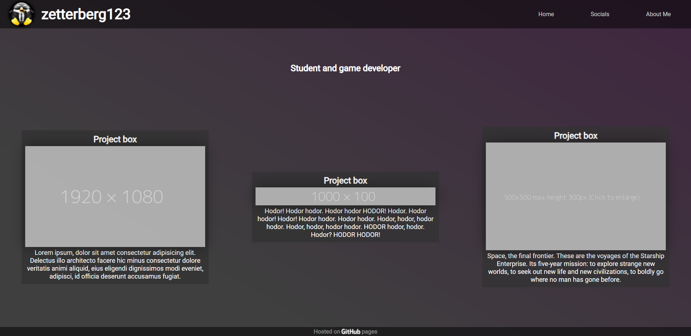
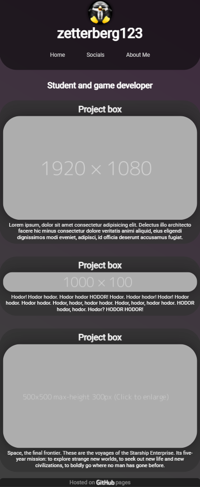

# Website

https://www.zetterberg123.com/

## Changelog

### 2022 changes
- Contact page
- Icons and dates for projects 
- Image/Video modal
- Added projects

### 2021 changes and final release

> Ehh it could be better, but I think it came out ok.

- Final iteration and whole new design (kind of)
    - Responsive flex layout (works on mobile)
    - Everything is centered
    - Mobile friendly rounded corner design (i hate it but it doesn't look out of place)
    - Static background 
    - Github logo link instead of text
    - Header and footer are smaller
    - Navigation bar (for future pages)
    - Custom scrollbar
    - Project boxes
- Javascript
    - Click image to expand
    - Mau approved easter egg

- robots.txt (excludes images from search engines)

### 2020 changes temporary work in progress website
- First iteration
- Second iteration

### Progress images
- First iteration

- Second iteration

- Final iteration

    Desktop layout

    
    Mobile layout

    
